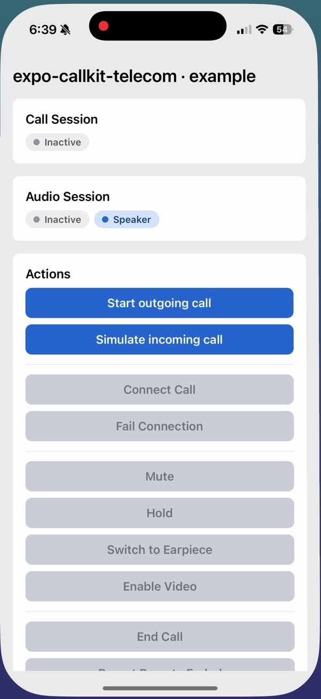
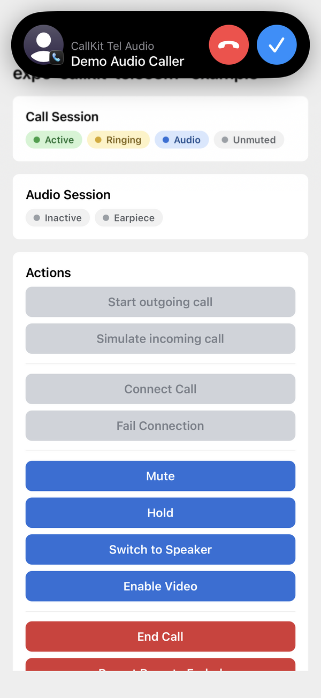
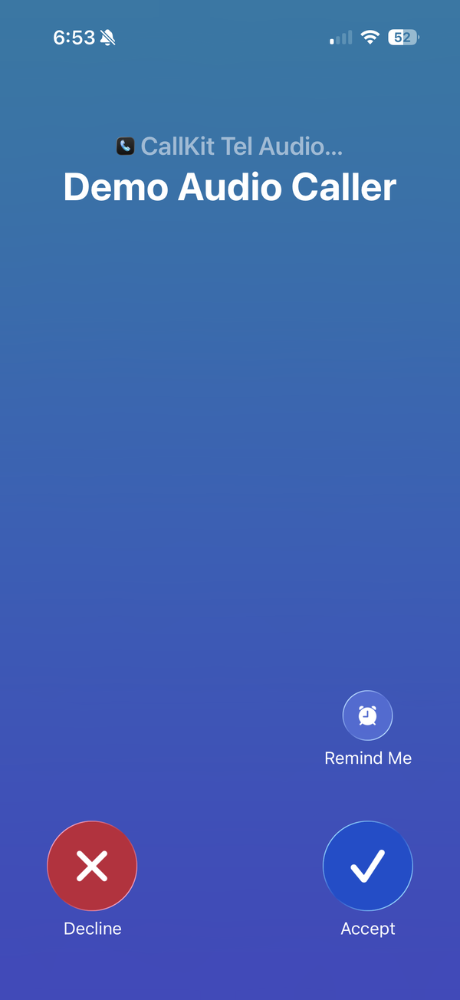
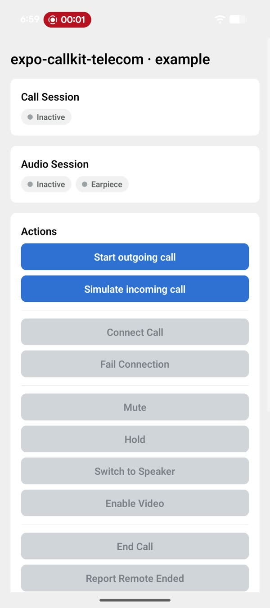
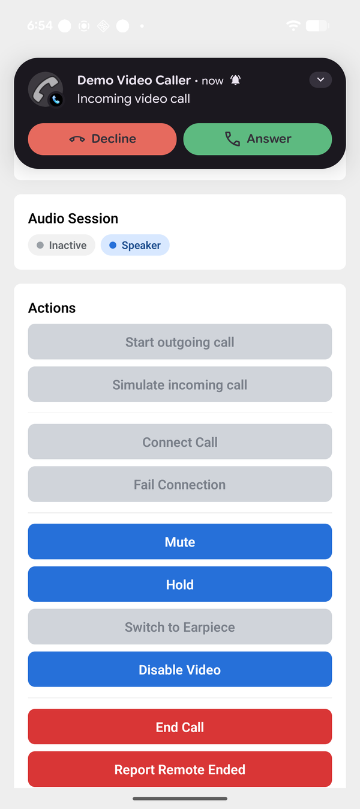
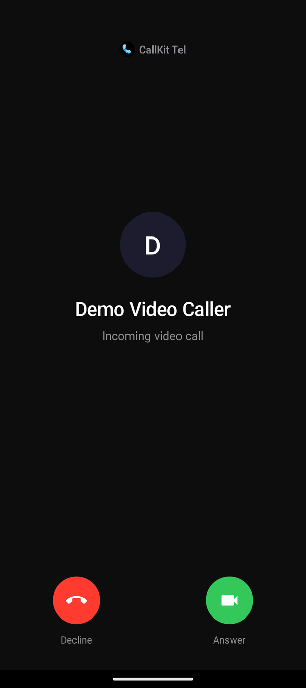

# 📞 expo-callkit-telecom — native calling UI for Expo (CallKit + Jetpack Core-Telecom)

> A modern Expo module — written in Swift and Kotlin — that wraps **CallKit** on iOS and **Jetpack Core-Telecom** on Android with API parity. It owns the system call UI, the audio session, and VoIP push — your app owns the media (e.g. LiveKit, plain WebRTC, etc.).

The module is opinionated about *system integration* and unopinionated about *media*. You wire your media library to the events it emits.

📖 **Full documentation:** [mfairley.github.io/expo-callkit-telecom](https://mfairley.github.io/expo-callkit-telecom/)

<p>
  <a href="https://www.npmjs.com/package/expo-callkit-telecom"></a>
  <a href="https://www.npmjs.com/package/expo-callkit-telecom"></a>
  <a href="https://mfairley.github.io/expo-callkit-telecom/"></a>
  
  
</p>

<h2 align="center">📱 See it in action</h2>

<table align="center">
  <tr>
    <th></th>
    <th align="center">Outgoing call</th>
    <th align="center">Incoming (banner)</th>
    <th align="center">Incoming (full screen)</th>
  </tr>
  <tr>
    <td align="center"><strong>iOS</strong></td>
    <td align="center">
      <video src="https://github.com/mfairley/expo-callkit-telecom/raw/main/docs/public/outgoing-call-ios.mp4" controls muted playsinline width="200" poster="https://github.com/mfairley/expo-callkit-telecom/raw/main/docs/public/outgoing-call-ios-poster.jpg">
        
      </video>
    </td>
    <td align="center"></td>
    <td align="center"></td>
  </tr>
  <tr>
    <td align="center"><strong>Android</strong></td>
    <td align="center">
      <video src="https://github.com/mfairley/expo-callkit-telecom/raw/main/docs/public/outgoing-call-android.mp4" controls muted playsinline width="200" poster="https://github.com/mfairley/expo-callkit-telecom/raw/main/docs/public/outgoing-call-android-poster.jpg">
        
      </video>
    </td>
    <td align="center"></td>
    <td align="center"></td>
  </tr>
</table>

## ✨ Features

- 📱 **Native calling UI** — CallKit on iOS, Telecom incoming-call notification + full-screen intent on Android
- 🔔 **VoIP notifications** — APNs VoIP on iOS (PushKit), FCM data messages on Android, parsed natively so calls can be reported from a terminated state
- 🎵 **Ringtones** — system ringtone for incoming calls, configurable via the config plugin
- ☎️ **Dialtone** — looped dialtone with fade-in for outgoing calls, configurable
- 🎧 **Audio session management** — cross-platform port types (`builtInReceiver`, `builtInSpeaker`, `headphones`, `bluetoothA2DP`, `bluetoothHFP`, `bluetoothLE`, `airPlay`, `hdmi`, `carAudio`, `usbAudio`, `lineOut`)
- 🔊 **Speaker override** and live route-change events
- 🎚️ **Mute, hold, video, DTMF** — both directions: app → system and system → app (e.g. native mute button → your media)
- 🗣️ **Call intents on iOS** — Recents list, Siri ("call Jane")
- 🧩 **Typed TypeScript API** with a single `CallSession` object that tracks state across the call lifecycle

## 🧪 Verified against

This release is exercised end-to-end on real devices via the runnable `example/` app.

| | Tested against |
| --- | --- |
| iOS | 26 (minimum 15.1) |
| Android | 15 (minimum API 26) |
| Expo SDK | 55 |
| React Native | 0.83 |
| New Architecture | Yes |
| Media transport | LiveKit RN SDK |

## 📦 Install

```sh
bun add expo-callkit-telecom
```

Add the config plugin to `app.json` / `app.config.ts`. Minimal form:

```jsonc
{
  "expo": {
    "plugins": ["expo-callkit-telecom"]
  }
}
```

With custom ringtone and dialtone:

```jsonc
{
  "expo": {
    "plugins": [
      [
        "expo-callkit-telecom",
        {
          "sounds": [
            "./assets/sounds/ringtone.caf",
            "./assets/sounds/dialtone.caf"
          ],
          "defaultRingtoneIos": "ringtone.caf",
          "defaultRingtoneAndroid": "ringtone.caf",
          "defaultDialtone": "dialtone.caf",
          "incomingCallTimeout": 45,
          "outgoingCallTimeout": 60,
          "microphonePermission": "$(PRODUCT_NAME) needs the microphone to make calls."
        }
      ]
    ]
  }
}
```

Files in `sounds` are copied into the iOS bundle and Android raw resources at prebuild time. The full prop type is `ExpoCallKitTelecomPluginProps` in `plugin/src/`.


## 🧠 Concepts

The TS API is organised into three verbs:

| Verb         | Direction              | Examples                                                              |
| ------------ | ---------------------- | --------------------------------------------------------------------- |
| **Request**  | App → System           | `startOutgoingCall`, `answerCall`, `endCall`, `setMuted`              |
| **Report**   | App → System (state)   | `reportIncomingCall`, `reportOutgoingCallConnected`, `reportCallEnded` |
| **Fulfill**  | App → System (ack)     | `fulfillIncomingCallConnected`                                        |

Events flow the other way (System → App) via `addXxxListener`.

## 🚀 VoIP push payload

When the OS delivers a VoIP push (PushKit on iOS, an FCM data message on Android), the module parses the payload natively — before JS is running — and reports the call to the OS.

The event itself is always the same shape on both transports. All keys are camelCase:

```jsonc
// IncomingCallEvent (the "inner" event)
{
  "eventId": "550e8400-e29b-41d4-a716-446655440000",   // required (UUID), for dedup
  "serverCallId": "9e7f...",                           // required — your backend's call id
                                                       //   (distinct from CallSession.id,
                                                       //    which is the OS-assigned UUID)
  "hasVideo": false,
  "startedAt": "2026-01-15T19:42:11.000Z",             // RFC 3339, optional
  "caller": {
    "id": "<caller id>",                               // required — opaque, stable
    "displayName": "Jane Smith",
    "avatarUrl": "https://...",
    "phoneNumber": "+14155551234",                     // optional; must be E.164 if present
    "email": "jane@example.com"
  },
  "metadata": {                                        // optional, opaque pass-through
    "chatId": "abc-123",
    "tenantId": "acme-co"
  }
}
```

Any keys you put under `metadata` are forwarded verbatim from the push payload all the way through to your JS event handler. The lib treats them as opaque — you cast at the read site:

```ts
Calls.addCallAnsweredListener(({ id }) => {
  const session = /* lookup */;
  const chatId = session?.incomingCallEvent?.metadata?.chatId as string | undefined;
});
```

Both transports wrap the event under an `incomingCall` key, just at different layers — APNs in the push payload dictionary, FCM in the data block:

### 🍎 iOS — APNs VoIP push

Send a VoIP push (`apns-push-type: voip`) whose dictionary payload nests the event under `incomingCall`:

```jsonc
{
  "incomingCall": { /* IncomingCallEvent — see above */ }
}
```

### 🤖 Android — FCM data message

FCM data values must be strings, so JSON-encode the inner event and put it under `incomingCall`:

```jsonc
{
  "data": {
    "messageType": "incomingCall",
    "incomingCall": "{\"eventId\":\"...\",\"serverCallId\":\"...\", ... }"
  }
}
```

Non-`incomingCall` data messages are forwarded to `expo-notifications`'s service for normal handling.

## 🧪 Example

`example/` contains a runnable Expo app (`example/client/`) and a zero-dep push-sender script (`example/server/`). See their READMEs for setup and how to validate VoIP push end-to-end.

## 🔑 Registering for VoIP push

```ts
import {
  registerVoIPPush,
  useVoIPPushToken,
} from "expo-callkit-telecom";

// Once, early in app lifecycle:
registerVoIPPush();

// In a React component:
function App() {
  const voip = useVoIPPushToken();
  useEffect(() => {
    if (voip) {
      // voip.type is "APNS_VOIP" on iOS, "FCM" on Android.
      sendToBackend(voip.token, voip.type);
    }
  }, [voip]);
}
```

## 📚 API surface

See `src/Calls.ts` for full JSDoc. Main areas:

- **Sessions** — `getActiveCallSession`, `addCallSession{Added,Updated,Removed}Listener`
- **Outgoing** — `startOutgoingCall`, `addOutgoingCallStartedListener`, `reportOutgoingCallConnected`
- **Incoming** — `reportIncomingCall`, `addIncomingCallReportedListener`, `answerCall`, `addCallAnsweredListener`, `fulfillIncomingCallConnected`, `failIncomingCallConnected`
- **End** — `endCall`, `addCallEndedListener`, `reportCallEnded`
- **Audio** — `getAudioSession`, `setAudioSessionPortOverride`, `prepareAudioSessionForCall`, `addAudioRouteChangedListener`
- **Mute / Hold / Video / DTMF** — `setMuted`, `setHeld`, `reportVideo`, `playDTMF` and their listeners
- **VoIP push** — `registerVoIPPush`, `getVoIPPushToken`, `useVoIPPushToken`, `addVoIPPushTokenUpdatedListener`

## 📝 Platform notes

- 🍎 **iOS** — requires the `voip` background mode and a VoIP push certificate. Uses CallKit + PushKit + WebRTC's `RTCAudioSession` for manual audio control. Min iOS 15.1.
- 🤖 **Android** — requires `MANAGE_OWN_CALLS` permission, min SDK 26. Uses `androidx.core:core-telecom`. Incoming calls come via FCM data messages — the config plugin registers `ExpoCallKitTelecomMessagingService` automatically.
- 🎟️ VoIP push token type is reported as `"APNS_VOIP"` on iOS and `"FCM"` on Android — send both to your backend so it knows which transport to use.

## ⏰ Keeping connections alive in the background

This module hands the OS a CallKit/Telecom call, which keeps the *process* alive during a call — but JS timers (`setInterval`, `setTimeout`) and JS-side network heartbeats are still subject to background throttling once the screen locks. If your media stack needs an app-level heartbeat (e.g. a WebSocket signalling channel) to survive the background, pair this module with [`react-native-nitro-keepalive-timer`](https://www.npmjs.com/package/react-native-nitro-keepalive-timer) to get native timers that fire reliably while a call is active.

## 🆚 Comparison with `react-native-callkeep`

[`react-native-callkeep`](https://github.com/react-native-webrtc/react-native-callkeep) is the long-standing React Native library in this space. `expo-callkit-telecom` solves the same problem but is built on the current generation of platform APIs: Jetpack `androidx.core:core-telecom` on Android, Swift + Kotlin, the Expo Modules API with a config plugin, and `RTCAudioSession` coordination for manual-audio WebRTC stacks like LiveKit. It also parses APNs VoIP and FCM data payloads natively, so the cold-start incoming-call case works without app-side glue.

Full side-by-side, compatibility matrix, and migration notes: **[docs/vs-callkeep.md](docs/vs-callkeep.md)**.

